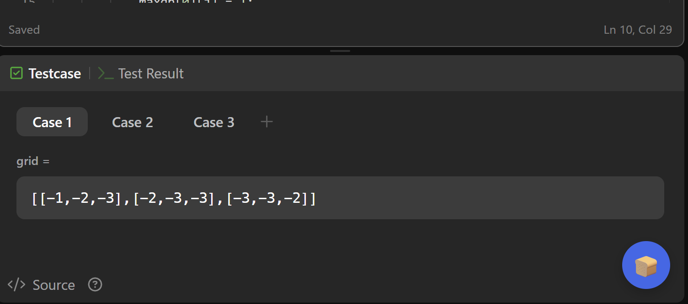
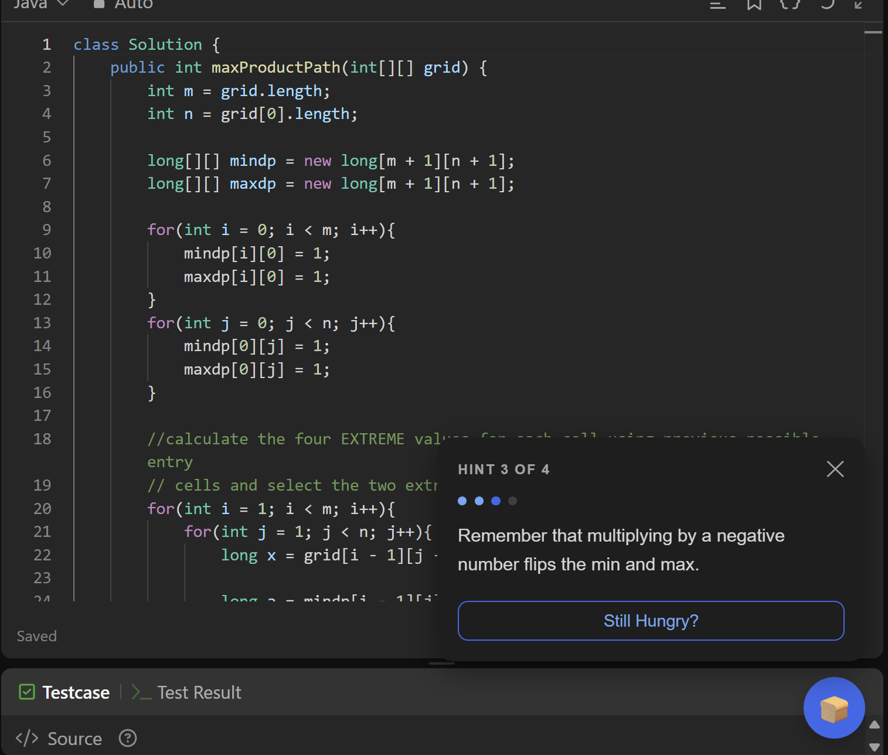

# 🍞 BreadCrumb

> Just enough bread to keep you rolling.

BreadCrumb gives you nudges on LeetCode problems without 
giving away the answer. Get 4 progressively specific hints, 
one at a time — so you keep the satisfaction of solving it yourself.

## Installation

1. Clone this repo git clone
```bash
git clone https://github.com/yourname/breadcrumb.git
```
Or simply download the .zip file and extract it on your PC.

2. Open Chrome and go to `chrome://extensions`
3. Enable **Developer mode** (top right toggle)
4. Click **Load unpacked** and select the cloned folder
5. Click the BreadCrumb icon and add your API key

## Getting a free API key

- **Gemini** (recommended): [aistudio.google.com](https://aistudio.google.com) — free tier
- **Groq** : [console.groq.com](https://console.groq.com) — free, no credit card

## How it works

Paste your API key by clicking on the extension icon in the menu bar.
Click 🍞 on any LeetCode problem to get your first hint.
Not enough? Hit "Still hungry?" for the next crumb.
4 hints total, each more specific than the last.

## Features

- 4 progressively specific hints per request
- Detects if your approach is wrong and redirects you
- Supports Groq (Llama 3) and Google Gemini
- Secure - Your API key never leaves your browser

## Privacy

Your API key is stored locally in your browser only.
No data is collected or sent anywhere except your chosen AI provider.


